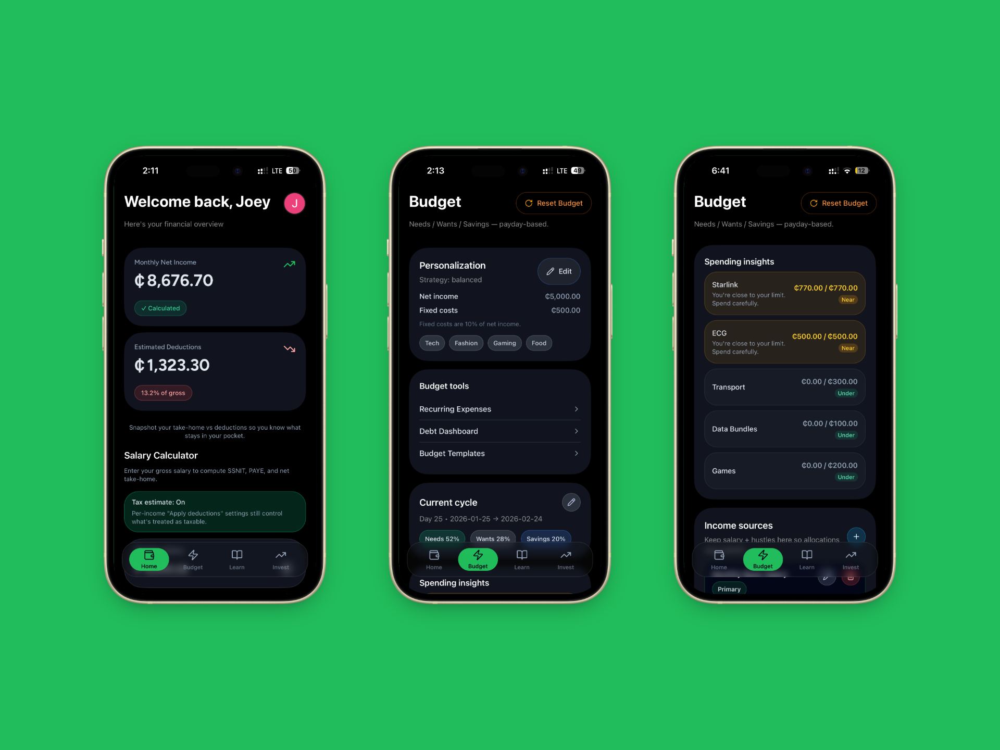

<p align="center">
  
</p>

<h1 align="center">CediWise</h1>
<p align="center">
  <strong>Smart finance for Ghana. Your money, simplified.</strong>
</p>

<p align="center">
  
</p>

<p align="center">
  <a href="#features">Features</a> •
  <a href="#project-structure">Structure</a> •
  <a href="#quick-start">Quick Start</a> •
  <a href="#tech-stack">Tech Stack</a>
</p>

---

## About

**CediWise** is a lean, high-accuracy financial tool built for Ghanaian users. It helps individuals and small businesses manage salary, taxes, budgets, and investments—with support for Ghana’s 2026 tax rules, SSNIT, PAYE, and VAT.

> _Banker aesthetic • Deep Green • White • Gold accents_

---

## Features

| Category      | Capabilities                                                                |
| ------------- | --------------------------------------------------------------------------- |
| **Salary**    | Basic salary input → SSNIT (5.5%), PAYE (7-tier), Net take-home             |
| **SME**       | Sales & expense ledger, 20% Unified VAT, VAT threshold alerts (GHS 750,000) |
| **Budget**    | Category budgets, spent vs remaining progress bars                          |
| **Auth**      | Phone OTP (Arkesel), Google Sign-In                                         |
| **Knowledge** | Financial literacy tips, GSE stocks & T-Bill rates                          |

---

## Project Structure

```
CediWise/
├── assets/                    # Shared images (banner, logo)
├── cediwise-mobile-app/       # Expo React Native app (Android, iOS)
├── cediwise-web-official/     # TanStack Start web app (landing, legal, feature pages)
├── supabase/                  # Edge functions (auth, OTP)
├── LICENSE                    # MIT License
└── .github/                   # CI/CD (Android builds)
```

---

## Quick Start

### Mobile (Expo)

```bash
cd cediwise-mobile-app
npm install
npx expo start
```

### Web

```bash
cd cediwise-web-official
npm install
npm run dev
```

---

## Environment

| Variable                   | Description          |
| -------------------------- | -------------------- |
| `EXPO_PUBLIC_SUPABASE_URL` | Supabase project URL |
| `EXPO_PUBLIC_SUPABASE_KEY` | Supabase anon key    |

---

## Data Standards (Ghana 2026)

- **PAYE**: 7-tier graduated tax (0% from GHS 490)
- **SSNIT**: Capped at GHS 69,000 monthly insurable earnings
- **Unified VAT**: 20% (15% VAT + 2.5% NHIL + 2.5% GETFund)

---

## Tech Stack

- **Mobile**: React Native, Expo, Supabase, Firebase
- **Web**: TanStack Start, React, shadcn/ui
- **Backend**: Supabase (auth, realtime, edge functions)

---

## Web App Pages

The official web app includes:

- **Product**: [Salary Calculator](https://cediwise.app/salary-calculator) • [Budgeting Tool](https://cediwise.app/budgeting-tool) • [SME Ledger](https://cediwise.app/sme-ledger) • [Financial Literacy](https://cediwise.app/financial-literacy)
- **Company**: [About Us](https://cediwise.app/about) • [Contact](https://cediwise.app/contact)
- **Legal**: [Privacy Policy](https://cediwise.app/privacy) • [Terms of Service](https://cediwise.app/terms)

---

## License

This project is licensed under the MIT License — see [LICENSE](LICENSE) for details.

---

<p align="center">
  <sub>Built for Ghana by <a href="https://joshua-ansah.vercel.app">Joshua Ansah</a> • Offline-first • High-contrast UI</sub>
</p>
