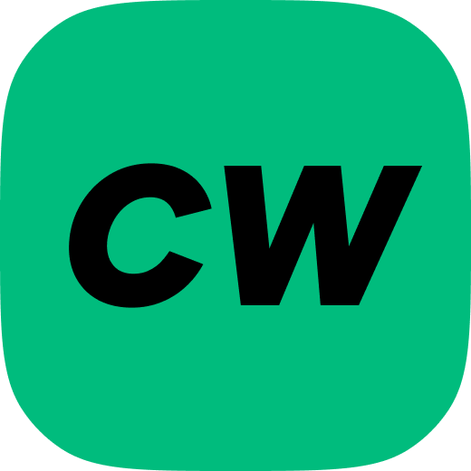
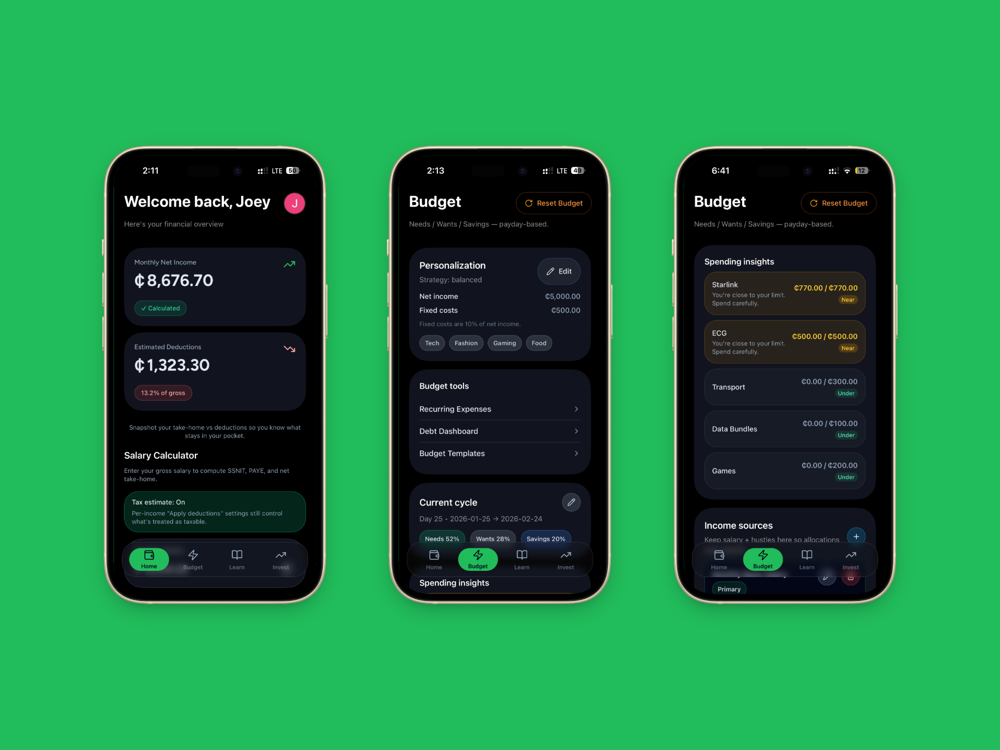

<p align="center">
  
</p>

<h1 align="center">CediWise</h1>
<p align="center">
  <strong>Smart finance for Ghana. Your money, simplified.</strong>
</p>

<p align="center">
  
</p>

<p align="center">
  <a href="#features">Features</a> •
  <a href="#project-structure">Structure</a> •
  <a href="#quick-start">Quick Start</a> •
  <a href="#tech-stack">Tech Stack</a>
</p>

---

## About

**CediWise** is a lean, high-accuracy financial tool built for Ghanaian users. It helps individuals manage salary, taxes, budgets, and financial literacy—with support for Ghana’s 2026 tax rules, SSNIT, PAYE, and VAT.

> _Banker aesthetic • Deep Green • White • Gold accents_

---

## Features

### Mobile App

| Category | Capabilities |
| -------- | ------------ |
| **Salary** | Basic salary input → SSNIT (5.5%), PAYE (7-tier), net take-home; Tax & salary calculator; SSNIT/PAYE toggle on income sources |
| **Budget** | Category budgets (Needs/Wants/Savings), spent vs remaining progress bars; Vitals wizard for personalization; multiple income sources; budget templates; spending insights |
| **Debt** | Debt dashboard — add debts, record payments, payoff estimates, linked to budget cycles |
| **Recurring expenses** | Weekly, bi-weekly, monthly, quarterly, annually |
| **Auth** | Phone OTP (Firebase), Google Sign-In |
| **Financial literacy** | 7 modules, 34 lessons; glossary; calculators: PAYE & SSNIT, budget builder, savings goal, loan amortization, T-Bill projection, cash flow |
| **Investment** | Tab placeholder — coming soon (GSE, T-Bill content in literacy) |
| **Offline** | Mutation queue for budget changes; local storage sync |
| **Other** | Onboarding; guided tours; in-app update checks; push notifications |

### Web App (cediwise.app)

- **Product**: Salary Calculator, Budgeting Tool, SME Ledger, Financial Literacy
- **Company**: About Us, Contact
- **Legal**: Privacy Policy, Terms of Service

### Admin Dashboard

- Users management
- Learning data: lessons, T-Bill rates, feedback, progress
- Announcements & push notifications
- Email campaigns

---

## Project Structure

```
CediWise/
├── assets/                       # Shared images (banner, logo)
├── cediwise-mobile-app/          # Expo React Native app (Android, iOS)
│   ├── app/                      # Expo Router screens
│   ├── components/               # UI components
│   ├── calculators/              # PAYE/SSNIT, T-Bill, savings, loan, cash flow
│   ├── content/                  # Bundled lesson content
│   └── supabase/                 # Schema, migrations (FLM, analytics)
├── cediwise-dashboard/           # Next.js admin dashboard
│   ├── app/(dashboard)/          # Users, learning-data, feedback, emails, announcements
│   └── supabase-functions/       # Edge functions (e.g. send-email-campaign)
├── cediwise-web-official/        # TanStack Start web app (landing, legal, feature pages)
├── content/                      # Lesson content (Markdown)
├── docs/                         # Specs, plans, PRDs
├── LICENSE
└── .github/                      # CI/CD (Android builds)
```

---

## Quick Start

### Mobile (Expo)

```bash
cd cediwise-mobile-app
npm install
npx expo start
```

For native builds (required for Firebase Phone Auth):

```bash
npx expo run:android
# or
npx expo run:ios
```

### Web

```bash
cd cediwise-web-official
npm install
npm run dev
```

### Dashboard

```bash
cd cediwise-dashboard
npm install
npm run dev
```

---

## Releases & Distribution

### Android (Play Store)

- Newer **Android builds** are distributed via the **Google Play Store** (testing track) instead of standalone APK files.
- To join the testing track:
  - Click "Join Beta" on [CediWise](https://cediwise.app)
  - Use a Google account to join the CediWise Test Group on Google Group
  - Opt in for Closed testing to download the app
  - Open the link on your device, accept the invitation, and install **CediWise** from the Play Store
- For local development builds, use the **Mobile (Expo)** quick start steps above.

### Web

- The official production web app is live at `https://cediwise.app`.

---

## Environment

| Variable | Description |
| -------- | ----------- |
| `EXPO_PUBLIC_SUPABASE_URL` | Supabase project URL |
| `EXPO_PUBLIC_SUPABASE_KEY` | Supabase anon key |

For the mobile app, Firebase is used for phone auth and analytics; configure `google-services.json` (Android) and Firebase for iOS as needed.

---

## Data Standards (Ghana 2026)

- **PAYE**: 7-tier graduated tax (0% from GHS 490)
- **SSNIT**: Capped at GHS 69,000 monthly insurable earnings (5.5% employee contribution)
- **Unified VAT**: 20% (15% VAT + 2.5% NHIL + 2.5% GETFund); GRA may apply additional levies (e.g. COVID-19 Health Recovery Levy)

---

## Tech Stack

| Layer | Technologies |
| ----- | ------------ |
| **Mobile** | React Native, Expo (expo-router, expo-dev-client), Supabase, Firebase (auth, analytics), heroui-native, FlashList, react-native-reanimated |
| **Web** | TanStack Start, Vite, React, shadcn/ui |
| **Dashboard** | Next.js, Supabase, shadcn, Recharts |
| **Backend** | Supabase (auth, realtime, edge functions); auth-phone-firebase for Firebase→Supabase session |

---

## License

This project is licensed under the MIT License — see [LICENSE](LICENSE) for details.

---

<p align="center">
  <sub>Built for Ghana by <a href="https://joshua-ansah.vercel.app">Joshua Ansah</a> • Offline-first • High-contrast UI</sub>
</p>
