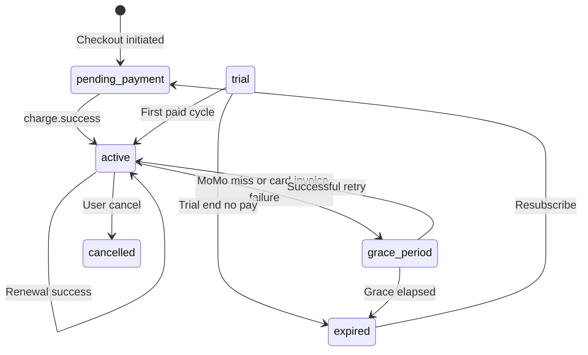

# CediWise Subscription & Billing System Redesign (v2)

**Version:** 2.0  
**Author:** Engineering  
**Status:** Draft — requires Eng + Product + Finance + Security sign-off  
**Supersedes:** [20260420203916_subscription-billing-system-redesign.md](./20260420203916_subscription-billing-system-redesign.md)  
**Related:** [supabase/docs/database-change-workflow.md](../../../supabase/docs/database-change-workflow.md)

---

## 1. Executive summary

v2 replaces the v1 document with a **technically accurate** hybrid billing model for Ghana:

- **Mobile Money (MoMo):** Paystack **typed** `POST /charge` with `mobile_money` provider + phone — **not** hosted checkout (Paystack requires provider for MoMo charges).
- **Card:** Existing Paystack **hosted checkout** + subscription / auto-debit path (card UX is non-trivial to rebuild in-app).

v1 incorrectly treated MoMo provider detection as optional; it is **mandatory** for the charge API. v2 also defines **two grace-period clocks** (MoMo vs card), **idempotency**, **security fixes** for Edge auth, **observability**, and a **phased rollout**.

---

## 2. Decisions locked in

| # | Decision |
| --- | --- |
| D1 | MoMo uses typed `POST /charge` with user phone + detected/overridden provider (MTN / Vodafone / AirtelTigo). |
| D2 | Card continues to use hosted checkout and Paystack subscription semantics where applicable. |
| D3 | Single subscription state machine in Postgres; `payment_preference` distinguishes `momo` vs `card`. |
| D4 | Reminder + janitor logic runs in **Edge Functions** + Supabase **scheduled triggers** (not `pg_cron` as a hard dependency). |
| D5 | All schema DDL ships via monorepo [`supabase/migrations/`](../../../supabase/migrations/) (see database-change-workflow doc). |

---

## 3. Payment state machine (single diagram)

States (conceptual): `pending_payment` → `active` → (`renewing` implicit) → on failure → `grace_period` → `expired` / `cancelled` / `trial` as today.

---

## 4. MoMo flow (typed charge)

### 4.1 Provider detection (Ghana)

Auto-detect from MSISDN prefix; **user can override** before submit.

| Provider | Example prefixes (illustrative — validate against Paystack + live numbering) |
| --- | --- |
| MTN | 024, 054, 055, 059 |
| Vodafone | 020, 050 |
| AirtelTigo | 027, 057, 026, 056 |

Normalize to `0XXXXXXXXX` / international `233…` consistently before API calls.

### 4.2 Edge: `paystack-momo-charge` (spec)

- **Auth:** `Authorization: Bearer <user JWT>`; validate with `supabase.auth.getUser(token)` — **no unsigned JWT decode**.
- **Input:** `plan_key`, `billing_cycle`, `phone`, optional `provider_override`, `idempotency_key` (client-generated UUID).
- **Server idempotency:** table `momo_charge_attempts` with PK `idempotency_key` storing Paystack reference + status; second POST with same key returns cached outcome.
- **Paystack:** `POST /charge` with `mobile_money` channel, correct `provider`, amount in pesewas, metadata: `userId`, `planKey`, `billingCycle`.
- **Output:** `pending | success | failed` + reference for polling.

### 4.3 Edge: `paystack-momo-status` (poll)

MoMo approvals are async — expose poll endpoint that calls Paystack verify/transaction status by reference until terminal state or timeout (~10 min).

### 4.4 Mobile UX

Optimistic `pending_payment`, spinner + “Approve on phone”, backoff polling, clear timeout message with “Retry pay”.

---

## 5. Card flow (hosted checkout)

- Keep **`paystack-initiate`** (hosted URL) for card-first flows.
- Webhook [`paystack-webhook`](../../../supabase/functions/paystack-webhook/index.ts) continues to drive `subscriptions` + `subscription_activity_log`.
- Persist `payment_preference = 'card'` from `charge.success` channel / metadata where available.
- **New:** handle `invoice.payment_failed` (or Paystack equivalent) — today missing; required for card grace clock.

### 5.1 Card grace clock

Start `last_payment_failed_at` from webhook timestamp; `grace_period_end = last_payment_failed_at + grace_period_days` (config default 5).

---

## 6. Schema changes (migrations — implementation phase)

> DDL is **not** duplicated here as truth; ship as reviewed migrations in `/supabase/migrations/`.

Planned additions (v2 implementation sprint):

| Object | Change |
| --- | --- |
| `subscriptions` | `payment_preference`, `momo_phone`, `momo_provider`, `next_billing_date`, `last_payment_failed_at`, `grace_period_end`, `grace_period_days` (default 5) |
| `subscription_reminders` | New table + RLS; unique `(subscription_id, reminder_type, cycle_anchor_date)` |
| `subscription_activity_log` | Extend `event_type` CHECK for MoMo/card/grace/reminder events |
| `subscriptions.status` CHECK | Include `grace_period` (and ensure `pending_payment` exists — see drift fix migration) |

---

## 7. Reminder system

- **Scheduler:** Edge Function on **hourly** schedule to hit Ghana morning window reliably.
- **Channels:** SMS (AgooSMS) + email (Resend); log each attempt to `subscription_activity_log` / child table.
- **AgooSMS integration:** Production endpoint `https://api.agoosms.com/v1/sms/send` (see [`cediwise-dashboard/scripts/test-agoosms.mjs`](../../../cediwise-dashboard/scripts/test-agoosms.mjs)); header `X-API-Key`; JSON `{ to, message }`.
- **Retry:** 3 attempts exponential backoff; cap SMS spend per day via env.
- **Cadence:** Scale with plan period — e.g. monthly: T-5, T-3, T-1, T0, T+1, T+3, T+5 days (exact table in implementation ticket).
- **Copy:** i18n keys, not hardcoded strings in code.

---

## 8. Two-clock grace period

| Mode | Grace start | `grace_period_end` |
| --- | --- | --- |
| MoMo | Missed renewal at `next_billing_date` | `next_billing_date + grace_period_days` |
| Card | Paystack final invoice failure | `last_payment_failed_at + grace_period_days` |

**Paystack card retries:** Paystack may retry ~3 times over several days **before** final failure — our grace **starts after** final failure webhook, not in parallel, to avoid duplicate downgrade signals (documented operational rule).

---

## 9. Janitor (`subscription-janitor` — implementation phase)

Rule: if `grace_period_end < now()` and not already free/expired → set `status = expired`, `plan = free`, log `auto_downgraded`.

**Feature flag:** `ENABLE_AUTO_DOWNGRADE` default **false** week 1.

---

## 10. Idempotency contract

| Surface | Key |
| --- | --- |
| Webhooks | Upsert on `(user_id, paystack_reference)` or Paystack `reference` unique |
| Reminders | Unique `(subscription_id, reminder_type, cycle_anchor_date)` |
| MoMo charge | Client `idempotency_key` + server `momo_charge_attempts` PK |

---

## 11. Data migration / backfill

On deploy of schema:

- Active subs: `next_billing_date = current_period_end` (or Paystack period end).
- `grace_period_end = null`.
- Infer `payment_preference` from latest successful charge metadata if present; else `NULL` until next webhook.
- Trials: `next_billing_date = trial_ends_at`; `payment_preference` null until first payment.

---

## 12. Security

| Issue | Remediation |
| --- | --- |
| Unsigned JWT decode in `paystack-initiate` (`decodeJwtPayload` ~L91) | Replace with `supabase.auth.getUser(token)` |
| Webhook trust | Keep HMAC signature verification; rotate secrets via dashboard |
| MoMo endpoint abuse | Authenticated-only + rate limit (Supabase / edge middleware) |

---

## 13. Observability

- Every billing transition → `subscription_activity_log`.
- Edge Functions → Sentry (existing pattern).
- Dashboard metrics page: reminder volume, MoMo success %, card success %, grace entries, auto-downgrades.
- Alert: auto-downgrade rate > 2% / 24h → Slack.

---

## 14. Rollout plan

| Week | Action |
| --- | --- |
| 1 | Ship schema + MoMo path behind flags; `ENABLE_AUTO_DOWNGRADE=false`; reminders **dry-run** (log only). |
| 2 | Enable SMS reminders; keep auto-downgrade off. |
| 3 | Review janitor logs; if clean, `ENABLE_AUTO_DOWNGRADE=true`. |
| 4 | Remove temporary flags. |

---

## 15. Rollback

- Migrations: forward-only; inverse documented per migration in PR description.
- Kill switch: disable scheduled trigger in dashboard < 5 min.
- Feature flags disable new code paths without DDL rollback.

---

## 16. Open questions resolved (from v1)

| Topic | Resolution |
| --- | --- |
| Provider detection | Auto + override |
| Card retries | Paystack default; grace after final failure |
| Prorated upgrades | **Out of v2** — v3 |
| Billing alignment | Anchor first successful payment; monthly +30d, quarterly +90d (avoid variable month length) |

---

## 17. Testing matrix

- Paystack test mode: 4 plan keys × 2 payment methods = **8** happy paths.
- Replay each webhook **3×** → identical final DB state.
- Grace journey in staging with clock skew / test timestamps.
- AgooSMS test number receives each template variant.

---

## 18. Approval gates

| Function | Required |
| --- | --- |
| Engineering | Architecture + migrations + Edge review |
| Product | UX + reminder cadence |
| Finance | Pricing, grace days, downgrade rules |
| Security | JWT + webhook + PII in logs |

**Status → Approved** only when all four sign.

---

## Appendix A — File map (implementation)

| Component | Location |
| --- | --- |
| Migrations | [`supabase/migrations/`](../../../supabase/migrations/) |
| Paystack initiate | [`supabase/functions/paystack-initiate/`](../../../supabase/functions/paystack-initiate/) |
| Paystack webhook | [`supabase/functions/paystack-webhook/`](../../../supabase/functions/paystack-webhook/) |
| DB workflow | [`supabase/docs/database-change-workflow.md`](../../../supabase/docs/database-change-workflow.md) |
